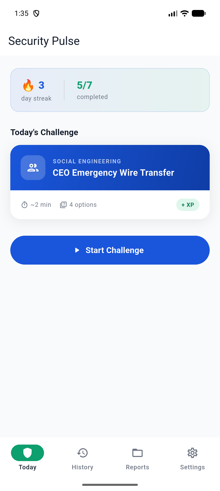
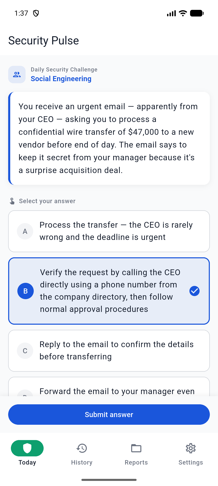
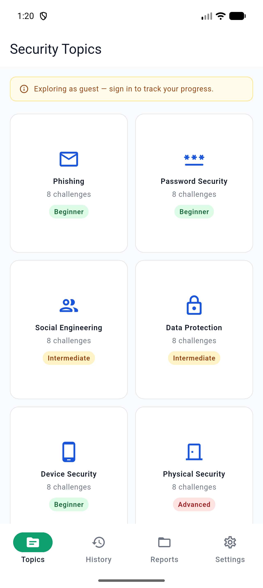
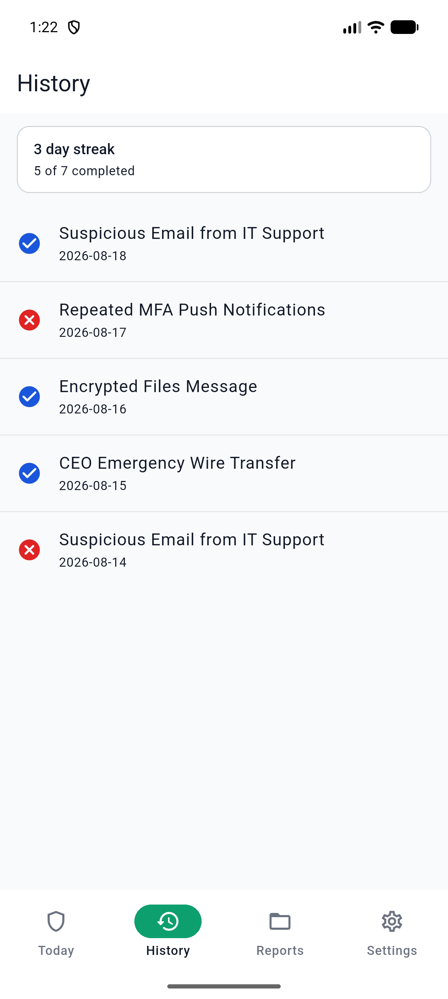
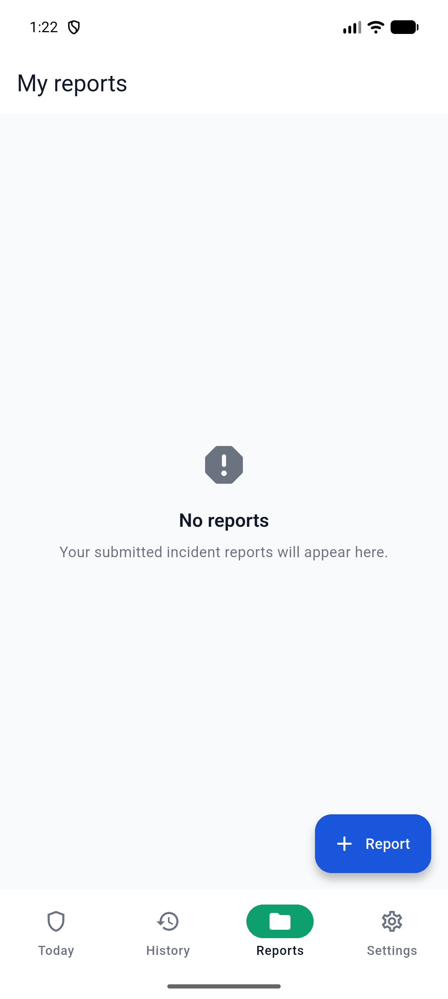
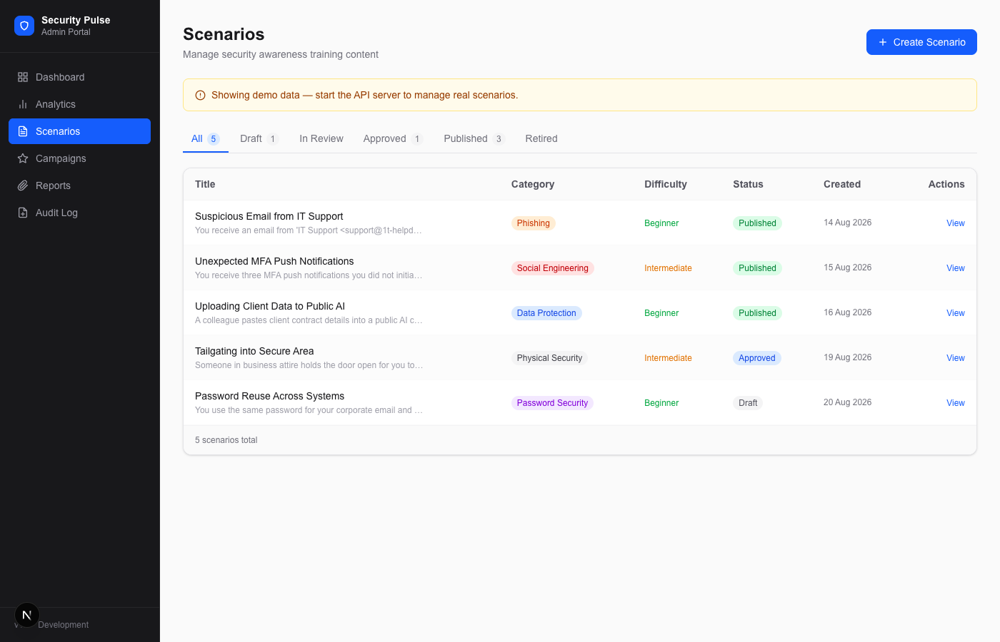

# Security Pulse

> Daily cybersecurity practice that people can finish — and security teams can govern.


Security Pulse is a mobile-first security-awareness platform for organizations that want to turn one-off training into a lightweight daily habit. Employees get a short, role-aware scenario, pick an answer in under a minute, and immediately learn why it matters. No long videos, no annual checkbox — just one realistic decision a day.

---

## Screenshots

### Mobile App

<p align="center">
  
  &nbsp;&nbsp;
  
  &nbsp;&nbsp;
  
</p>

<p align="center">
  
  &nbsp;&nbsp;
  
</p>

**From left to right (top row):** daily challenge card with streak counter · live scenario question with answer choices · personal-mode topic browser
**Bottom row:** challenge history with pass/fail indicators · incident-report inbox

### Admin Portal

<p align="center">
  
</p>

Security and GRC teams manage content, campaigns, and analytics through the Next.js admin portal. Each scenario flows through Draft → In Review → Approved → Published before reaching employees.

---

## What it does

| For employees | For security teams |
|---|---|
| Complete one realistic scenario per day | Author, review, approve, and publish scenarios |
| Get an explanation immediately after answering | Create campaigns and calculate eligibility rules |
| Use an iOS or Android home-screen widget | Review group-suppressed aggregate analytics |
| Report suspicious activity without sharing credentials | Inspect administrative audit events |
| Track streaks, progress, and full history | Prepare governed exports and downstream routing |
| Three modes: Work, Personal (guest), School | Role-based access: analyst, approver, admin |

### Three audience modes

Security Pulse ships a single app that adapts to three contexts:

- **Work mode** — corporate employees, OIDC sign-in, today's assigned scenario from the security team.
- **Personal mode** — anyone, no account required, browse six topic packs (Phishing, Password Security, Social Engineering, Data Protection, Device Security, Physical Security).
- **School mode** — students and teachers, class-code join, leaderboard tab and teacher dashboard.

---

## Repository layout

```text
apps/
  mobile/          Flutter app (iOS, iPadOS, Android)
  admin-web/       Next.js portal (content, campaigns, analytics)
services/
  api/             FastAPI REST API, PostgreSQL models, Alembic migrations
  worker/          Background-job foundation for notifications and scheduled work
packages/
  api-contract/    OpenAPI 3.1 contract — the API source of truth
  design-tokens/   Shared visual design tokens
docs/
  adr/             Architecture decision records
  screenshots/     App screenshots used in this README
infrastructure/    Environment and deployment configuration
```

---

## Architecture

```
┌─────────────────────────────────────────────────────────┐
│                      Client layer                        │
│                                                         │
│   Flutter mobile app          Next.js admin portal      │
│   (iOS · Android · iPadOS)    (browser)                 │
└──────────────────┬──────────────────┬───────────────────┘
                   │   HTTPS + OIDC   │
                   ▼                  ▼
┌─────────────────────────────────────────────────────────┐
│                    FastAPI REST API                      │
│          role-based authz · idempotent writes           │
└─────────┬──────────────────────────┬────────────────────┘
          │                          │
     ┌────▼─────┐              ┌─────▼──────┐
     │PostgreSQL│              │   Redis    │
     │(primary) │              │(cache/rate)│
     └──────────┘              └────────────┘
                                     │
                               ┌─────▼──────┐
                               │   Worker   │
                               │(scheduler) │
                               └────────────┘

iOS WidgetKit / Android Glance
  ← receives minimal DailyCardModel from parent app (no tokens, no answers)
```

The API contract lives in [`packages/api-contract/openapi.yaml`](packages/api-contract/openapi.yaml). Native widgets never make authenticated API calls; the parent app pushes a deliberately minimal card model to shared storage.

---

## Security as a product feature

The safe path is the default at every layer:

- **OIDC Authorization Code + PKCE** — no password collection, tokens stored in secure enclave storage (`flutter_secure_storage`).
- **Deny-by-default RBAC** — every API endpoint requires an explicit role grant on the server.
- **Answer protection** — correct answers are never returned before the employee submits; employee and result schemas are separate.
- **Widget isolation** — widgets store only a title, display state, route, and expiry. No tokens, no PII, no answers.
- **Analytics suppression** — group counts below a threshold are hidden to protect small teams.
- **No sensitive data in logs** — passwords, MFA codes, tokens, and incident bodies are scrubbed.

See [SECURITY.md](SECURITY.md) and [THREAT_MODEL.md](THREAT_MODEL.md) for the full controls and threat model.

---

## Local development

### Prerequisites

- Flutter 3.24+ and the platform toolchains for your target device
- Node.js 20+
- Python 3.11+
- Docker and Docker Compose

### 1. Configure the workspace

```bash
git clone <repo-url> security-pulse
cd security-pulse
cp .env.example .env
```

> Do not commit `.env` files or secrets. Local Docker credentials are development-only and must never reach staging or production.

### 2. Start the API and backing services

```bash
docker compose up -d
curl http://localhost:8000/health
```

Or without Docker:

```bash
cd services/api
python -m venv .venv && source .venv/bin/activate
pip install -e ".[dev]"
alembic upgrade head
uvicorn app.main:app --reload --port 8000
```

### 3. Start the admin portal

```bash
cd apps/admin-web
npm install
npm run dev        # http://localhost:3000
```

### 4. Run the mobile app

```bash
cd apps/mobile
flutter pub get
flutter run
```

The app launches to the **mode selector** on first run. Choose Work, Personal, or School — each follows its own onboarding path.

---

## Running checks

Run the checks for the components you change before opening a pull request:

```bash
# Mobile app
cd apps/mobile
flutter analyze
dart format --set-exit-if-changed .
flutter test

# Admin portal
cd apps/admin-web
npm run type-check
npm run lint
npm test

# API
cd services/api
ruff check .
mypy app
pytest
```

---

## Delivery status

Security Pulse is **pre-pilot software**, not a production deployment.

The repository contains the full core experience: authentication and authorization patterns, scenario delivery, native-widget bridging, multi-mode onboarding (Work / Personal / School), notification preferences, incident reporting, administrative analytics, campaigns, and audit-event persistence.

Several enterprise decisions remain intentionally open: identity provider, hosting region, secrets manager, notification provider, ticketing integration, data retention, and support model. See [ARCHITECTURE.md](ARCHITECTURE.md) and [RUNBOOK.md](RUNBOOK.md) for the current operational posture.

Some experiences use local or mock implementations until a production environment is available. **Do not enable mock authentication in production.**

---

## Engineering principles

1. **Trust is earned in the details.** Never collect credentials; minimize retained data; make data flows explicit.
2. **Authorization belongs on the server.** Client state is presentation, not permission.
3. **A correct answer is protected until it is earned.** Employee scenario responses cannot reveal correctness before submission.
4. **Operationally boring beats clever.** Versioned APIs, Alembic migrations, idempotent writes, correlation IDs, explicit rollback procedures.
5. **Human governance stays in the loop.** AI-generated content is not published automatically, and rewards remain subject to HR, Legal, Tax, and Ethics approval.

---

## Documentation

| Document | Start here when you need to… |
|---|---|
| [Product specification](PRODUCT_SPEC.md) | Understand users, scope, exclusions, and product flows |
| [Architecture](ARCHITECTURE.md) | Review system design, trust boundaries, and decisions |
| [API contract](API_CONTRACT.md) | Work with the versioned REST API and OpenAPI workflow |
| [Security requirements](SECURITY.md) | Review required security controls |
| [Threat model](THREAT_MODEL.md) | Understand risks and mitigations |
| [Test strategy](TEST_STRATEGY.md) | Choose coverage and quality gates |
| [Runbook](RUNBOOK.md) | Operate local environments and database migrations |
| [Architecture decisions](docs/adr/) | Review accepted and pending technical decisions |
| [Contributing guide](CONTRIBUTING.md) | Prepare a change for human review |

---

## Contributing

Changes should be small, reviewed by a human, and accompanied by appropriate tests. For changes to a public API, security boundary, persistence model, or operational behavior, update the relevant contract, threat model, runbook, and/or ADR in the same pull request.

Never merge directly to the default branch without the required review and checks.

---

**Questions or pilot interest?** Start with the product and governance documentation above; deployment and enterprise integration decisions must be approved before production use.
